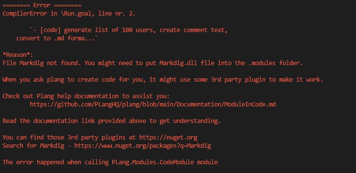

# Using Third-Party Libraries in PLang

PLang is a versatile language that allows you to extend its functionality by integrating third-party libraries. One common source for these libraries is NuGet, a popular package manager for .NET. This guide will walk you through the process of incorporating a third-party library into your PLang project.

## Understanding the Error

When you attempt to use a third-party library in PLang, you might encounter an error indicating that the compiler cannot find a specific file. This typically happens when the library is not included with PLang by default. To resolve this, you need to manually download and integrate the library.

## Steps to Use NuGet Packages in PLang

### 1. Identifying the Missing Library

When you receive an error about a missing file, note the library name. This is the library you need to find and download from NuGet.

### 2. Download the Package

- Visit [nuget.org](https://www.nuget.org).
- Enter the library name in the search bar and click "Search".
- Review the search results carefully. Choose a package with a high number of downloads and active maintenance to minimize security risks.

### 3. Download and Prepare the Package

- Click "Download Package" to receive a `.nuget` file.
- Rename the `.nuget` file to `.zip`.
- Unzip the file to access its contents.

### 4. Integrate the Library into PLang

- Locate the `.dll` file within the unzipped contents. This is the file you need to integrate.
- Create a `.services` folder in your PLang project directory if it doesn't already exist.
- Place the `.dll` file into the `.services` folder.

## Example: Using the Markdig Library

Let's consider an example where you want to use the Markdig library to convert text to Markdown format.

### PLang Code Example

```plang
Run
- [code] generate list of 100 users,
    create comment text, convert to .md format, using 3rd party library(Markdig)
     with columns: name, email, comment, write to %users%
```

### Error Encounter

When you run `plang build`, you might see an error similar to the one below:



This error indicates that the Markdig library is missing.

### Resolving the Error

1. **Search for Markdig on NuGet**: Go to [nuget.org](https://www.nuget.org/packages/Markdig) and search for "Markdig".
2. **Download the Package**: Confirm the package is actively maintained and has a high number of downloads. Click "Download package".
3. **Prepare the Package**: Rename the downloaded file to `.zip`, unzip it, and locate the `markdig.dll` file in the `.net 8` folder.
4. **Integrate the Library**: Place `markdig.dll` into your project's `.services` folder.

By following these steps, you can successfully integrate third-party libraries into your PLang projects, enhancing their functionality and capabilities. Always exercise caution when downloading and integrating external libraries to ensure the security and stability of your applications.