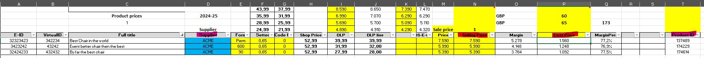

# Automating the Boring Work with Plang

I have a client who is managing a product catalog. Part of it is automatic, and part is manual work.

The catalog is of electronic products, so importing those products into the website is automatic.

The pricing, however, is not automatic; it's not just a fixed percentage. The client goes over the list and types in the prices.

Most prices are automatic, but when you know the market, you want to price yourself correctly in the market.

## The Process

The client doesn't have much control over improving the automation; it's a process that he is stuck with.

So the process is this:

1. Excel file with all the products.
2. Decide pricing.
3. Extract the data into a new CSV file for import into the website system.
4. Log in to the admin system.
5. Find the correct supplier.
6. Go to "Import prices."
7. Upload the file.
8. Get error information, if any.
9. Confirm the price changes.

This needs to be repeated for every supplier, as the system is set up so that you can only update prices for each supplier at a time.

In this case, my client has 19 suppliers. That means he needs to create 19 different import CSV files and repeat steps 3-9 a total of 19 times.

Being not too computer-savvy, he often makes some errors, slowing him down even more. Very time-consuming.

## What is the plan?

My client will still continue to use the Excel file; he knows it and he is happy with it.

The problem is, when he decides on the new prices for products, he needs to do those steps 3-9.

## Solve it with Plang

Let's solve this in Plang.

We start by exporting the data from the Excel file. In this case, the data with headers starts at row 5 in column A.

This is how the Excel file looks. It's a bit complex, but we are only interested in the 4 columns highlighted in red.



Let's create `ProcessExcel.goal`:

```plang
ProcessExcel
- read e-products.xlsx, data starts in "A5", has header, 
        Sheet 'Prices',
        write into %rows%
```

The Excel file has multiple sheets; we only need the `Prices` sheet. The first 4 rows contain some fixed data that he uses to calculate the price, which we don't want to include in our data, so we start at column A, row 5, or in Excel terms `A5`.

We have now extracted all the data from the sheet `Prices` into the `%rows%` variable, starting at A5, telling the code that the rows have headers. This will allow me to use the headers to access the values.

The next step is to process those rows.

I want to load the data into a database. This will allow me to work with the data in SQL, giving me more flexibility.

Since Plang has a built-in database, we don't need to worry about setting up a separate database, but we do need to define the table.

These will be the columns we will be creating in our `price_import` table:
- `product_id`: This is the ID in the admin system of that product, provided in the Excel file as "Product ID."
- `cost_price`: This is the cost of the product from the supplier, provided in the Excel file in the "Cost Price" column.
- `selling_price`: This is the selling price of the product on the website, provided in the "Selling Price" column in the Excel file.
- `supplier_id`: This is the ID of the supplier in the admin system. This is NOT provided by the Excel file, but we do have the column `Supplier`, so we can match the name and find out the `supplier_id` from that.
- `error`: If there is any error with this specific product.

Create `Setup.goal`:

```plang
Setup
- create table price_import, columns:
    product_id(int, not null), cost_price(int, not null), selling_price(int, not null), supplier_id(int, not null), error(int, default 0)
```

The Excel file does not define the `supplier_id`, but it has the `Supplier` column, so let's create a mapping between the supplier name and supplier ID.

```plang
- create table suppliers, columns: name, supplier_id(int)
```

The suppliers don't really change much, so I will manually insert those into `Setup.goal`.

```plang
- insert into suppliers, name   supplier_id
    Acme  520
    Johnson  448
    Bloombery 2549
```

Plang will take this insert statement and figure out that "Acme" is to be inserted into the `name` column, and 520 into `supplier_id`, and the same for each line.

Now that we have the setup, let's finish processing the Excel file and then upload the CSV to the admin system.

The Excel file has 18 columns, but we only need 4 of them:

- "Product ID"
- "Cost price"
- "Selling price"
- "Supplier"

We will go through each row, check if the row is valid, and if it is, we insert it into the table `price_import`.

```plang
ProcessExcel
- read e-products.xlsx, "A5", has header, Sheet 'Prices', into %rows%
- go through %rows%, call FixRow

FixRow
- set variable %productId% = %item.Product ID%
- [code] round %item.Cost Price%, 0, return 0 if null or empty, write to %costPrice%
- [code] round %item.Selling Price%, 0, return 0 if null or empty, write to %priceRounded%
- if %costPrice% > 0 and %priceRounded% > 0 and %productId% is not empty or null, 
    then call InsertRow,
    else call WriteOutErrorInfo

InsertRow
- select supplier_id from Suppliers where name=%item.Supplier% (ignore case), return 1 row
- if %supplier_id% is empty then
    - write out '%item.Supplier% is not in db'
    - end goal
- insert into price_import, %supplier_id%, productId=%productID%, cost=%costPrice%, price=%priceRounded%

WriteOutErrorInfo
- write out 'Error with item: %item%'
```
> When you see `[code]` you are telling the Plang build to generate C# code. This should always be very simple things as LLM are bad at generating code. In this instance, rounding a number is easy.

We now have all the rows from the Excel file in our table. 

Let's create a CSV file that the admin system requires to be uploaded.

We start by:
- Getting all the suppliers in our database.
- Going through each supplier.
- Retrieving all the products that belong to that supplier.
- Saving it as a CSV.

Now let's write the code.

```plang
ExportToCsv
- select supplier_id from Suppliers group by supplier_id, write to %supplierIds%
- foreach %supplierIds%, call SaveCsv

SaveCsv
- select product_id, cost as "purchase price", price as "selling price" from price_import where supplier_id=%item.supplier_id%, write to %products%
- save %products%, delimiter ';', to suppliers/%item.supplier_id%.csv
```

Notice in the select statement in `SaveCsv`, we give each column a name. This is because the admin system we will be uploading to has a specific scheme for the .csv file.

```csv
product_id;purchase price;selling price
```

We now have the data in a CSV file.

Let's upload it into the admin system.

### What Needs to Happen

We need to... (step 4-9 from above)
- Open a browser & navigate to the admin system.
- Type in the username and password.
- Click the submit button.
- Navigate to the import prices page for that specific supplier.
- Upload the file.
- Write down any errors.
- Confirm the price changes.

If the system tells us that the product doesn't exist, we update our table with `error=1`.

In the `UploadFile` goal, we need to parse out the supplier ID from the file name so we can navigate to the correct URL.

Each admin system has its own version of how this is done, and it needs to be written for each system.

In this specific admin system, if there are any errors, they appear in `.content-header .alert-warning` divs, so we extract any of those and call `ProductNotFound`.

### Code

```plang
UploadData
- open https://www.example.org/admin/
- set value of #username to %Settings.Username%
- set value of #password to %Settings.Password%
- click button input[type=submit]
- read absolute path to all files in /suppliers/, write to %filePaths%
- go through each %filePaths%, call UploadFile %filePath%=item
- close browser

UploadFile
- [code] get filename from %filePath%, remove full path, and '.csv', write to %supplierId%
- navigate to https://example.org/admin/supplier/import-prices/%supplierId%
- set value on input[name=import_csv] to %filePath%
- click input[name=_submit]
- get all elements that have class '.content-header .alert-warning', write to %mismatchProducts%
- foreach %mismatchProducts% call ProductNotFound
- navigate to https://example.org/admin/supplier/import-prices/%supplierId%?supplierId=1068&do=updatePrices

ProductNotFound
- [code] extract number from %item.Text%, 
            example of text is: 'product number "123" not found'
            only return the number, trimmed
            return empty if number cannot be found or Text is empty
            write to %missingProductId%
- update price_import set error=1 where productId=%missingProductId%
```

And we are done.

## Conclusion

In about 50-60 lines of code, we have a fully automated system that can tell us if there are some errors on products.

Writing this code took about 60 minutes, and it cost me about $1.5 to build.

In essence, it took me less time to write this code than it takes me to upload all 19 suppliers just one time.

This is the power that [Plang](https://plang.is) brings you.
