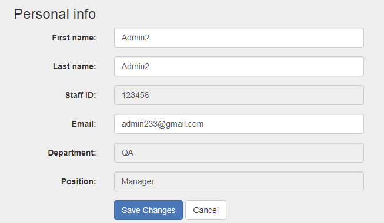

# Why Everybody Hates Forms (And How Plang Makes Them Better)

Forms. As a web developer, I’ve never been a fan. They’re the monotonous, repetitive part of web development: writing endless lines of HTML for inputs, selects, and textareas. As a user? They’re tolerable at best—definitely not anyone’s favorite.

## How It All Began: The Origin of Forms

Let’s rewind to understand how we ended up with forms.

Originally, when businesses needed information from clients, employees would jot down a list of questions and go ask them in person. With the advent of computers, those lists moved to Word documents. Employees printed them out, asked clients the questions, and filled out the forms manually.

Then came the internet, and we digitized these lists into web forms. Now, clients fill out the questions themselves, saving companies time and effort.

At its core, the process hasn’t changed much:
1. A company creates a list of questions.
2. They share that list with the client (printed or digital).
3. The client answers the questions.
4. The company collects the answers and acts on them.


## Why Forms Don’t Cut It Anymore

The only reason we’ve relied on forms is that structured data is essential for businesses, and forms were the easiest way to get it. But that’s no longer the case—computers now understand natural language.

Imagine the difference:

### Traditional Form


### Natural Language Prompt
```
What is your full name and email?
```

If you prefer the form, it’s likely because you’ve been conditioned to interact with computers that way—not because it’s better. 

It’s time to break free.


## Redefining “Forms” in Plang: A Better Way to Gather Information

Forms in Plang aren’t forms in the traditional sense. It’s more about **information gathering**—and it starts with a question list, just like in the analog world.

### Step 1: Define Your Questions

Create a `questions.txt` file:

```txt
User Information
- Name of user
- Email of user
```

At a glance, this file makes it clear what information we’re seeking: the user’s name and email.

### Step 2: Structure the Data

Businesses and computers thrive on structured data. To bridge the gap between human-friendly questions and machine-readable data, let’s use Plang to prepare the questions.

Create `PrepareQuestions.goal`:

```plang
PrepareQuestions
- read questions.txt, write to %questions%
- [llm] system: Format each property(starts with -)
        user: %questions%
        scheme: {questions:[{text:string, name:string}]}
        write to %structuredQuestions%
```

Here’s what’s happening:
1. The content of `questions.txt` is read into the `%questions%` variable.
2. An LLM (Large Language Model) formats the questions into structured data.

### Bridging the Analog and Digital Worlds

The scheme in the code — {questions:[{text:string, name:string}]} — is where the analog and digital worlds meet.

The text property represents the question as it appears in the real world—what the user would see, like "Name of user" or "Email of user."
The name property serves as a digital identifier, a key that allows the data to be processed and stored systematically.

By linking the human-readable text with the structured name, Plang bridges the gap between how we ask questions in the analog world and how we process their answers in the digital one. This approach ensures that data remains both intuitive for humans and usable for computers.

The result:
```json
[{
    "text": "Name of user",
    "name": "name"
},
{
    "text": "Email of user",
    "name": "email"
}]
```

If you want to ensure consistency in naming, you can modify `questions.txt` like this:
```txt
User Information
- Name of user {name:"name"}
- Email of user {name:"email"}
```

We now want to insert those results into database

```plang
- select id from questions where path="questions.txt", return 1 row
- if %id% is empty then
    - insert into questions table, questions=%structuredQuestions%, path="questions.txt"
- if %id% is not empty
    - update questions set questions=%structuredQuestions% where %id%        
```

We check if those questions already exists in the database, if they dont exist, we insert otherwise update the table.

This will allow us to update the questions through `questions.txt` easily


### Step 3: Copy Questions into a New Table

Here’s where the analog world gives us a clue. Think about how we do this in real life: we create a printed copy of the questions to give to the client. We can replicate this process digitally by storing a copy in the database for answers.

Update `Setup.goal` to create a table for answers:

```plang
- create answers table, columns: answers(string, not null), is_finished(bool, false), created(datetime, default now)
```

Then, create `Answer.goal` the entry point into the application

We will store a copy of the questions:

```plang
Answer
- select %answers%, id as %answer_id% from answers where is_finised=0, return 1 row
- if %answer_id% is empty then
    - call goal PrepareQuestions
    - select questions as %answers% from questions where path='questions.txt', return 1 row
    - insert into answers, answers=%answers%, write to %answer_id%
```
We check if there there are unaswered questions, if there are none, we call `PrepareQuestions` goal to insert or update all the questions, then we go the the `questions` database, retrieve those questions and insert them into the `answers` table.

This step mirrors the analog approach—copying the questions to collect answers.

## Asking the Questions

To gather answers, we’ll use an LLM to rephrase the questions conversationally.

```plang
- [llm] system: You are asking the user to answer the following questions, format them in a casual and conversational way, only ask 2-3 questions at a time. Ask only unanswered questions. selected_questions are the name properties.
        user: %answers%
        scheme: {text:string, selected_questions:string[]}
        write to %result%
- ask user %result.text%, write to %answer%
```

We ask the LLM to create a question for us, we then use that to ask the user and write his answer to the `%answer%` variable.


## Pro Tip: Externalizing the Mapping System for Flexibility

The client’s answers need to be structured for database storage. To achieve this, we use an LLM, but instead of hardcoding the LLM’s instructions, we store the `system` command in a separate text file. Why? Flexibility.

By externalizing the command into a file, you can easily tweak and experiment with the instructions without touching your codebase. This approach keeps your logic modular and simplifies iteration.

Create a `system.txt` file:

```txt
Following is an answer from the user for the <question>

<question>
%result.text%
<question>

The answer should map to the following <name_properties>

<name_properties>
%result.selected_questions%
<name_properties>

The user has these <questions_to_answers>, map the answer coming from the user to the same structure. Add the "answer" property to the object.

<questions_to_answers>
%answers%
<questions_to_answers>

Include all questions and answers in your response and do not guess the answer
```

Read this file dynamically in your `Answer.goal`. This method allows you to adjust the LLM’s behavior on the fly without diving into the code.

```plang
- read system.txt, load variables, write to %system%
```

Now let's ask the llm to structure the answer for us.

```plang
- [llm] system: %system%
        user: %answer%
        scheme: {questions:[{text:string, name:string, answer:string}]}
        write to %answers%
```


## Checking if All Questions Are Answered

Once we have the user’s answers, we update the `answers` table. 

```plang
- update answers set %answers% where %answer_id%
```

we need to ensure all questions have been addressed before proceeding.

Here’s how we check:
```plang
- filter %answers.questions[*]% where "answer"="", write to %unAnswered%
- if %unAnswered.Count% > 0, call Answer, else ShowResults
```

### What Does `%answers.questions[*]%` Mean?

Let’s break it down so everyone—technical or not—understands:
- `%answers.questions%` is a list of all the questions and their answers.
- `[*]` tells the system, "Look at every item in this list."
- `where "answer" is ""` filters out any questions that haven’t been answered yet.

For the technically inclined, this syntax follows **JSONPath**, a standard way to query JSON data structures. It’s like a shortcut for navigating complex data. 

If you want to learn more, you can search for "JSONPath examples."

## Wrapping Up: Gathering and Storing Answers

After ensuring all questions are answered, update the `answers` table to mark it as finished and display the results.

```plang
ShowResults
- update answers set is_finished=1 where %answer_id%
- write out "Name: %answers.questions[0].answer%"
- write out "Email: %answers.questions[1].answer%"
- write out %answers%
```

## Run the code

Now that we have made the code (see full code below), lets build it and run it.

```bash
plang build
```

and then

```bash
plang Answer
```

After answering the questions, you should get something like this


## Full code

You can find the plang app in my [Github repository](https://github.com/ingig/blogs/tree/main/EverybodyHatesForms). You should be able to run it without building, but that depends on the version of plang that you have.

### Setup.goal
```plang
Setup
- create table questions, columns: questions(text), path(string)
- create answers table, columns: answers(string, not null), is_finished(bool, false), created(datetime, default now)
```

### PrepareQuestions.goal
```plang
PrepareQuestions
- read questions.txt, write to %questions%
- [llm] system: Format each property(starts with -)
        user: %questions%
        scheme: {questions:[{text:string, name:string}]}
        write to %structuredQuestions%
- select id from questions where path="questions.txt", return 1 row
- if %id% is empty then
    - insert into questions table, questions=%structuredQuestions%, path="questions.txt"
- if %id% is not empty
    - update questions set questions=%structuredQuestions% where %id%        
```

### Answer.goal

```plang
Answer
- select %answers%, id as %answer_id% from answers where is_finised=0, return 1 row
- if %answer_id% is empty then
    - call goal PrepareQuestions
    - select questions as %answers% from questions where path='questions.txt', return 1 row
    - insert into answers, answers=%answers%, write to %answer_id%
- [llm] system: You are asking the user to answer the following questions, format them in a casual and conversational way, only ask 2-3 questions at a time. Ask only unanswered questions. selected_questions are the name properties.
        user: %answers%
        scheme: {text:string, selected_questions:string[]}
        write to %result%
- ask user %result.text%, write to %answer%
- read system.txt, load variables, write to %system%
- [llm] system: %system%
        user: %answer%
        scheme: {questions:[{text:string, name:string, answer:string}]}
        write to %answers%
- update answers set %answers% where %answer_id%
- filter %answers.questions[*]% where "answer"="", write to %unAnswered%
- if %unAnswered.Count% > 0, call Answer, else ShowResults

ShowResults
- update answers set is_finished=1 where %answer_id%
- write out "Name: %answers.questions[0].answer%"
- write out "Email: %answers.questions[1].answer%"
- write out %answers%
```

### questions.txt
```txt
User Information
- Name of user {name:"name"}
- Email of user {name:"email"}
```

### system.txt
```txt
Following is an answer from the user for the <question>

<question>
%result.text%
<question>

The answer should map to the following <name_properties>

<name_properties>
%result.selected_questions%
<name_properties>

The user has these <questions_to_answers>, map the answer coming from the user to the same structure. Add the "answer" property to the object.

<questions_to_answers>
%answers%
<questions_to_answers>

Include all questions and answers in your response and do not guess the answer
```


## Extending Your “Form”

With this approach, you can add or change questions in `questions.txt` and reload them in seconds using `PrepareQuestions.goal`. No need for additional programming. The result? A seamless, conversational experience for clients and structured data for your business.

Say goodbye to boring forms and hello to natural, human-friendly information gathering!