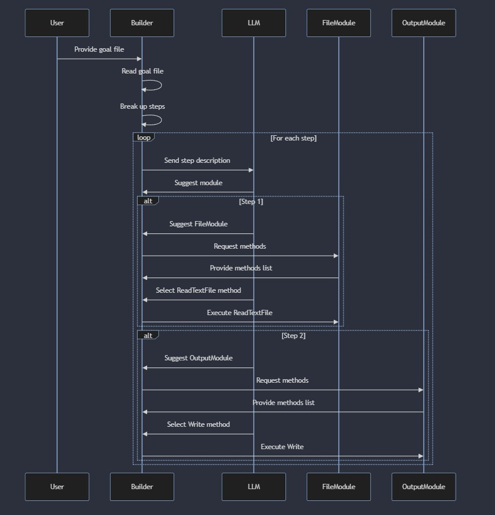

# Lesson 4: How Does The Builder Work?

Let's go back to this example:
```plang
ReadFile
- read file.txt, into %content%
- write out %content%
```

What the builder does is read the goal file and break up all the steps. It does a bit of analyzing using an LLM on the goal, and then for each step, it asks the LLM what [module](../modules/README.md) would fit the step.

We suggest around 30 modules to the LLM; one of them is called `FileModule`. "Hey," says the LLM, "I think it's the [`FileModule`](../modules/PLang.Modules.FileModule.md)."

Plang builder then receives that it is `FileModule`. "Ok, here are all the methods inside the `FileModule`. Can you select the one that fits the intent of the user?"

One of those methods is `ReadTextFile(string path) : string`, so if we call the `ReadTextFile` function for this step, it will get the text of the file read into the `%content%` variable.

And it repeats for the next step, `write out %content%`, which maps to the [`OutputModule.Write(object content)`](../modules/PLang.Modules.OutputModule.md) method.

## Sequence Chart


So that is how it works.

Next is [Lesson 5: Error and Events](./Lesson%205.md)
