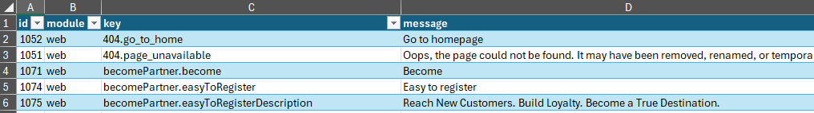

# Translating with Ease: Automating Translations with Plang

So, I recently had a client setting up a new website, and everything was written in English. The catch? They needed to translate it all into Icelandic. The developers handed over an Excel file with about 350 keywords to translate. Not a massive task, but still enough to be a bit of a time sink if done manually.

Here's a peek at how the Excel file looked:



Instead of slogging through it by hand, I figured I'd try out Plang to see if I could streamline the process and save everyone some time.

## Try it

If you like to try this, then [install Plang](https://github.com/PLangHQ/plang/blob/main/Documentation/Install.md) and get a [basic understanding](https://github.com/PLangHQ/plang/blob/main/Documentation/blogs/Lesson%202.md) of how Plang works

## Getting Started


First off, setting things up is a breeze. Just create a `Translate.goal` file and open it in your favorite text editor.

Kick things off with the line:

```plang
Translate
```

## Reading the Excel File

Next up, we need to read the Excel file. Here’s how you do it in Plang:

```plang
- read file translations.xlsx, sheet:translations, into %translations%
```

This tells Plang to grab the data from the `translations` sheet in `translations.xlsx` and load it into the `%translations%` variable.

## Splitting the List

With 350 keywords, sending everything to the language model in one go might be overkill. To avoid confusion (for the model and us), we split the list into chunks of 20 items:

```plang
- [code] split %translations% with 20 items in them,
     write to %translationsLists%
```

Now, `%translationsLists%` contains multiple smaller lists, each with 20 keywords. 

## Processing the List

Next, we loop through each chunk in `%translationsLists%` and call `TranslateList` for each one:

```plang
- foreach %translationsLists%, call TranslateList 
```

This step makes sure each group of keywords gets processed.

## Time to Translate

Here’s where the magic happens. We get the language model to translate the keywords into Icelandic:

```plang
TranslateList
- [llm] system: Translate the messages to Icelandic, leave key as is
    user: %item%
    scheme:[{key:string, message:string}]
    write to %translated%
```

After this, `%translated%` contains the Icelandic translations paired with the original keywords.

## Saving the Translations

Finally, we save the translations into a CSV file:

```plang
- append %translated% to csv file 'translate.csv'
```

And that’s it! We’ve got our translations neatly saved in `translate.csv`.

## Wrapping Up

In about five minutes, I put together a script that automates translating a list of keywords. Here's the full code:

```plang
Translate
- read file translations.xlsx, sheet:translations, into %translations%
- [code] split %translations% with 20 items in them,
     write to %translationsLists%
- foreach %translationsLists%, call TranslateList 

TranslateList
- [llm] system: Translate the messages to Icelandic, leave key as is
    user: %item%
    scheme:[{key:string, message:string}]
    write to %translated%
- append %translated% to csv file 'translate.csv'
```

It’s important to note that even though the heavy lifting is automated, a human still needs to review the translations. They’ll catch the context-specific nuances that the model might miss.

Feel free to tweak this approach for your own projects. Let me know how it works for you!

## More Information

If Plang is interesting to you, you should dig a bit deeper:

* [Basic concepts and lessons](https://github.com/PLangHQ/plang/blob/main/Documentation/blogs/Lesson%201.md)
* [Simple Todo example](https://github.com/PLangHQ/plang/blob/main/Documentation/Todo_webservice.md) is a good start
* Check out the [GitHub repo](https://github.com/PLangHQ/)
* [Meet up on Discord](https://discord.gg/A8kYUymsDD) or [GitHub discussions](https://github.com/orgs/PLangHQ/discussions) to get help and for general chat
* And [plang.is](https://plang.is), the official Plang website
* Chat with the [current Plang assistant](https://chatgpt.com/share/78637171-19bd-40d5-9c16-e53bd64c12b1)