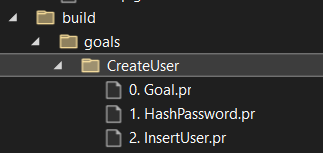
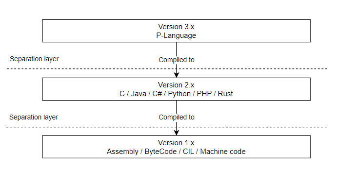
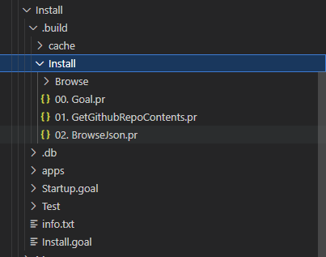
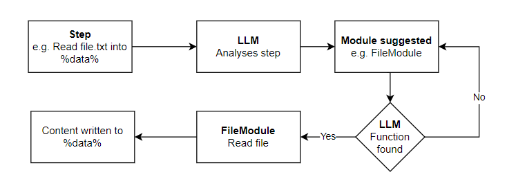
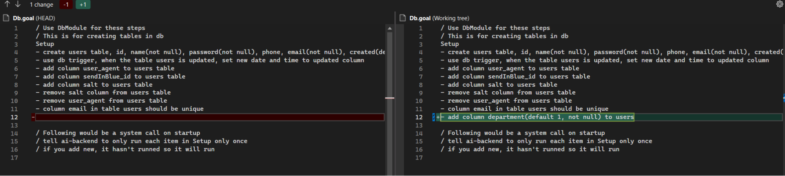
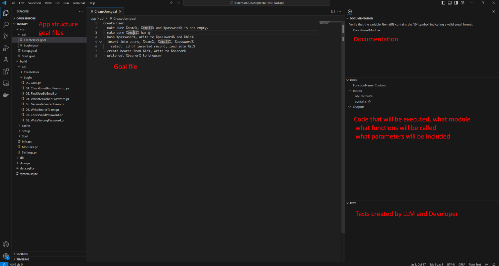

# Programming 3.0 - Theory

For some 60 years, we developers have been at version 2.x regarding programming. We are now entering version 3.0.

Introduction
------------

Version 1.x would be something like Assembly/Bytecode/IL, a low level programming with computer instructions. This is still used today, in fact the 2.x version of programming languages are often translated into this.

For some 60 years, we developers have been at version 2.x regarding programming. It is close to English, but difficult. It can be very complex. It's operational. We are required to type exactly what we want the computer to do. If we do something wrong, left becomes right, black becomes white.

We are now entering version 3.0. Computers are starting to understand abstract thinking.

Abstract thinking
-----------------

We humans do abstract things all the time. “Get the milk”, this for us, is a simple thing, but let's break it down.

- You need know what milk is
- You need to realize that the milk is stored in the fridge
- You need walk to fridge
- You need to open fridge
- You need to pick up milk
- You need to walk back to table
- You need to put down milk

And each of those bullet items is an abstract action in itself. Like “You need to open the fridge”, you need to raise your hand, know where to grab, and pull, etc. To program this would be almost impossible.

Programming 3.0
---------------

Now let's talk about programming.

You may have seen demos of somebody who created an app without or with little programming knowledge. It goes something like this: “Create a task app for me”. ChatGPT will generate a ton of code and if you are lucky it will run, most times you need to do a bit of fixing.

The clickbait headline reads: Programmers are no longer needed.

But here comes the tricky part. What if I want to modify the app just a little bit, like add a due date to my tasks or oauth login? I would have to ask ChatGPT to generate the whole code again, for sure it will be different than what I had before, logically, it might not work the same.

The thing with programming, each program, each company, each country has their own version of that same program. So as a programmer, you must have a fine grained control over each action of the program.

This is why those apps created by ChatGPT are a cool demo, but nothing more.

The theory
----------

This is my theory of programming 3.0. Best to show it with an example.

Let's create a user registration by using plang, most developers have done one before. Let's start by giving it a title and then list each action that will happen.
```plang
CreateUser
- Make sure name, email and password is not empty
- Hash password
- Write name, email, password to users table
- Create user in Brevo
- Create bearer token
- Write bearer token to response
```

That is it. Now compile and run 🤯

Here I describe step by step what should happen, if I need my custom action/property, it is easy for me to add, like the Brevo registration.

This looks easy to understand, most people would know what is happening except for the domain-related things, like Hashing, Brevo and what bearer token is. This is where you need domain knowledge.

This is also where you create context. You give an understanding to this function. It’s all in the details. “Create task app” gives no context.

All of this is handled by LLM, because it understands our abstract writing and translates it into computer code.

What is plang
-------------

plang (from pseudo language) allows you to define the business logic in natural language and have a runnable code. This is what developers would think of as a function or a method.

To understand what it means, lets give you an example:

Let's do the CreateUser function again, but something that would work as we provide more detail

1.  Create file Start.goal in your root folder
```plang
Start
- Start web server
```
2.  Create file Setup.goal in your root folder
```plang
 Setup
- Create table users, columns name(string, it cannot be empty),
	password(string, not null),
	email(string, not null), created(datetime, default now)
```


Now run Setup.goal,
```bash
$ plang exec Setup.goal
```
3.  Create folder api
4.  Create file CreateUser.goal
	
```plang
CreateUser
- Make sure %name%, %password% and %email% is not empty
- Hash %password%, write to %password%
- Insert into users, %name%, %password%, %email%
/ this is a comment. Next lines is a preparation for Brevo email service
- [code] Extract first name from %name%, write to %firstName%
- [code] Extract last name from %name%, write to %lastName%
- Post, create user in Brevo(former SendInBlue)
	Bearer %Settings.BrevoApi%
	parameters FNAME is %firstName%, LNAME is %lastName%
- Create bearer token from %email%, write to %bearer%
- Write %bearer% to web response
```
That is it. You now have a working and deployable business logic. There are rules and there are variables.

Run this code by opening your console/terminal.

Browse to the directory where Start.goal is located
```bash
$ plang exec
```
In you REST client, you can do POST to [http://localhost:9090/api/CreateUser](https://www.google.com/url?q=http://localhost:9090/api/CreateUser&sa=D&source=editors&ust=1703609183145586&usg=AOvVaw1m7f0o2MUGIIpi2h9qIA-l)

{“name”:”John Johnson”, “email”:”[test@example.org](mailto:test@example.org)”, “password”:”123”}

Or even better, write this in plang
```plang
RestTest
- POST http://localhost:9090/api/CreateUser,
	{name”:”John Johnson”, “email”:”[test@example.org](mailto:test@example.org)”, “password”:”123”}
	Write to %response%
- Write out %response%
```

Now 
```bash
plang exec RestTest.goal
```

If you read the “code”, you should be able to understand what is happening.

It is important to note, that this is not how you handle creating users in plang, it is much simpler. [That’s later](#h.n4hnflxkhb29)

Let's get technical
===================

What is Plang
-------------

Programming language written in any natural language.

What it is not
--------------

plang will not generate a whole project for you by describing it in one or more paragraphs like, “Create task app….”. This is not what plang is for.

Goals
-----

You need to be detailed in what you want to do and define each step of your business logic. The business logic is called Goal and each Goal has 1 or more Steps.

- For the developer, think of a Goal as a function/method that executes some business logic.
- For the business person, it is a business strategy you want to accomplish, a goal
- For others, it is something you would like to accomplish, a goal

In the above example, “CreateUser” is the goal.

Now that you are programming in natural language, business people can more easily understand what you are doing. You still need that deep knowledge that computer science provides (e.g. security, db, MQ, caching, etc.), but the business logic becomes much clearer.

### What are goals?

Think of it this way:

- User needs to register. That is a goal.
- User needs to be able to update his information. That is a goal.
- User needs to be able to reset his password. That is a goal.
- User should be able to retrieve a list of favorites. That is a goal.
- User should be able to search for products. That is a goal.
- System needs to analyze all new documents. That is a goal
- System should send info to an external system. That is a goal

plang is therefore built up on goals. You define the goals in plang, it's easy to understand.

Steps
-----

Inside a Goal there are multiple Steps. The steps describe what should happen. Each step should be clear and simple. LLM can handle simple commands, as soon as you ask it for multiple requests in the same step, the likelihood of success goes down.

Here is an example:
```plang
ReadAndUpdateFile (Goal)

- read %fileName% into %data% (Step)
- Update %data.name% to be same as %name% (Step)
- Save %fileName% with %data% (Step)
```
Now run the code
```bash
$ plang exec fileName=file.txt, name=”Micheal Scott”
```

### Modifying/adding/removing step

You can modify, remove or add a step to the goal. The builder will read the goal file again and decide what it needs to change.

The rule is simple: If the step text has changed, the execution path\* will be regenerated.

In the above example, let's add logic to add current time to the data.

The new goal would look like this
```plang
Read and update file (Goal)
- read %fileName% into %data% (Step)
- Update %data.name% = %name% (Step)
- Set %data.time% to be %Now% (Step)
- Save %fileName% with %data% (Step)
```
When the goal file is rebuilt, the property “time” in the data will contain the date and time.

*execution path: how this step was before, might change into something else. Reevaluate the step and generate the plan again, if you do something simple, like typo fixing, most likely it will be the same.

Builder & Runtime
-----------------

plang is divided into

- Builder - Analyzes your .goal files and generates code to be executed
- Runtime - Runs the code that has been built by reading .pr files

### Builder

Builder reads the goal, parses the file, determines which module to use for each step and asks the module to build the instructions to execute that step.

The builder builds the code at compile time, this allows the developer to confirm that the code results are what is expected and it allows the code to run at or close to native speed\*

*Everything in the system is loaded using reflection. It can take some time(a few milliseconds) to load modules using reflection. So today it’s slow in regards to native, but this hasn’t been optimized. It will get close to native. Fast enough for anybody. In the end, faster than any apps we can write

#### Build folder

When you build your application, the folder .build is created.

It contains sub folders

- Setup - Runs every goal only once
- Start - Runs goals on each startup
- Other goals - any other goal that is created

Each goal is stored in a folder named after the goal. Each folder has multiple files in it, defining the goal itself and then each step in the goal. To keep it clear, each file is numbered in the order of execution.



The files are JSON files with the file extension .pr. The JSON file allows the developer to debug the application. He should be able to see if the steps that he wrote are executing as expected.

***This takes time to learn.***

#### Code generation

plang does not generate full C# code to interpret the step that the user writes. Instead it uses modules that wrap a C# code that does a specific task and generates instruction to execute on those modules.

If you break down what developers mostly do, it falls mostly into these categories; file system access, db access, http access, cryptographics, conditions and loops, serving content(webserver/console/window), working with variables and calling other functions. Plang will attempt to generate code in C# if a module matching intent isn’t installed but only for simple logic.

Plang comes with built in modules, currently at 25 modules. When code is built, a step is sent to the LLM and asked what module should be used. The code is generated to fit the module. This is discussed in [Architecture](#h.ximru2jhon3y)

For more complex operations that are not provided by the built in modules, the developer can create a module and add it to his project. It is 1-2 files, depending on need.

#### Reliability of LLM

LLM are known for their hallucinations. This is not a problem in plang. We create the code at build time for the developer, so he can confirm that it does what the intent is. After that, the code does not change and will always run the same.

#### Instruction

Each step is built into an Instruction, that is then saved in the .build folder as “01. StepName.pr”. The file contains the step description from the user and the Action property with the instruction on what to do to execute the user request.

This is an example of instruction for the DbModule for this step

- retrieve users from db, paginate %page%, with 50 on each page, write to %users%

Instruction (DbModule)
```json
{
  "Action": {
    "FunctionName": "Select",
    "Inputs": {
      "sql": "SELECT \* FROM users LIMIT 50 OFFSET (@page - 1) \* 50",
      "Parameters": {
        "page": "%page%"
      }
    },
    "Outputs": {
      "users": "%users%"
    }
  },
  "Text": "retrieve users from db, paginate %page%, with 50 on each page, write to %users%",
}
```

If you open the DbModule.Program.cs file, you will see it contains a function called Select, it takes two parameters, sql and parameters variables. The Output is the variable that the result should be written to.

public async Task<dynamic?> Select(string sql, List<object>? Parameters = null)

It is actually quite simple, when you get it

#### Folder structure

In your root folder you will have your goals and subfolders.

- Setup.goal or Setup folder. setup file/folder contains goals such as database setup, creating tables, etc. Each step only runs one time
- Start.goal or Start folder. start file/folder contains goals that should run on startup, such as start web server or start window app
- Other goal files. Other goal files describe a function to be run.

When you compile the project, the compiler creates a .build folder that will contain commands for the application to run.

It will also create a .db folder that will contain a SQLite database, system.sql.

##### Setup folder

You define the setup of the system as goals. Located at /setup or in /setup.goal file

Each step in a goal located in the setup is executed only once. Here you would do things like, create tables, modify tables, create config files or anything that you only do once

Here are some examples:

Setup

- Create table users, columns id, name(not null), email(not null), password(not null), created(default now), updated(default now)
- When users table is updated, update column updated with current datetime
- Create config.json with {“hello”:”world”} as data

If you later decided to rename a column, you simply add a new step

- Rename column password to password\_hash on table users

It will run on the next startup and never again. This will also give you great [event sourcing](#h.dl6xx08nszej) for your setup.goal file in git, as each new line is a modification timeline for your setup.

##### Start folder

Goals located in the start folder run when the application starts.  Located at /start or /start.goal

Should this run as a web server or window app? Do you need to connect to a message queue service and listen for messages? Do you want to run a goal every x minutes?

Here are some examples:

Startup

- Use Redis for caching, default 10 min sliding
- Listen to rabbitmq for NewRegistration message, call !ProcessMQUserRegistration
- Every 2 minutes call !SyncUsers
- Start as webserver, 8080

At this moment(28 sept, 2023), 2 out of 4 work

### .db folder

Plang builder creates a .db folder. It always includes system.sql. This is where your api keys, your secrets and other settings live. At this time they are not encrypted (28.9, 2023). But I am sure it’s not long to wait until you can choose to have them encrypted and you unlock them with your bio/pin/face.

Often you have data.sql. This is the data for your application. This is where you create your sql tables and store the data.

There is another table in the data.sql that is called \_\_Events\_\_. This is [automatic event sourcing](#h.5moxu1jt31k9) built into the programming language.

### Runtime

The runtime starts by

1.  Loading Events
2.  Loading the goal files in the Setup folder and executing those that have not been executed before. If you have multiple goal files in the folder it will execute the setup.goal file last.
3.  Loading the goal files in the Start folder, and executing them. If you have multiple goal files in the folder it will execute the start.goal file last.

Start.goal file should be the entry point into the application.

If you are running a webserver, the http request that is made will invoke the goal requested(https://example.org/api/CreateUser).

It then goes to the .build folder, finds the matching file, reads it, and runs each module that is described in that .pr file.

#### Apps

Apps are Goals made by others. You can install apps that other developers have created. This can be any kind of app depending on your need, be it for parsing text, talking with external service, processing your Word files or working with videos.

These apps all run in their own context and have their own private keys, generated on first usage.

After you have installed an app, you can call in your code like any other goal. Since apps are simply goals.
```plang
- Call !Google.Search %query%, write to %search_results%
```
This is an example to call google search (this doesn't exist at this time) and get the search results into a variable.

#### Events

You can bind events before and after goal and step, you can bind an event on exception. You can bind an event on the application start and end. Soon you should be able to bind events to modules.

Create folder Events or Events.goal file in the the root folder

```plang
Events
- On all goals in api/\* call !Authenticate
- before each step call !AnalyzeStart
- after each step call !AnalyzeEnd
```
Or for user interface
```plang
Events
- before click on button sidebar call !ShowBrowser
- on Ctrl-k  call !ReformatFile
```

You guess the rest.

This is very powerful, you can now download an app created in plang and change it anyway you like. You can write your own version of it. Or like in the example above, provide authentication, analytics. All important to a developer, because he needs details.

Security & Privacy
------------------

I am confident in saying:

> Plang will become the most secure programming language, in any sense.

> Plang will give its users more privacy than any development tool can give, in any sense.

My security knowledge is moderate, I know the concepts and understand them mostly, but security is in the detail. So I'm sure there are flaws, but I believe the foundation is correct and adjustments are simply needed.

Referencing back to the beginning of this document, each version of a programming language is a new abstract layer on top of the old one.

You cannot make the computer do something unless the compiler for your C++ code can compile it into machine code. This means in theory, you can do some things in machine code that you just cannot do in C++.

plang is adding a new abstract layer, version 3 of programming languages, only allows you to do stuff in Version 2 that the compiler allows you to\*.

This creates an opportunity in using the knowledge we have learned over the last 60 years to implement a secure version of our applications for free to the developer. (free means, he doesn’t have to think about it)

* There is a problem here, where LLM does generate c# code, which is version 2 layer, which could allow for any execution, and run terminal and python scripts. But users can be protected from them and only run certified code.



### Folder structure

The following is the folder structure of a plang app.
```pre
Root - this is where you run plang run
Start.goal - start of your application
– api - these are rest apis
– ui - user interface
– events - where events are
– .build - where build files are
– .db - database for your root app.
	The private keys are stored in .db/system.sqlite
	data.sqlite is the data for the app
– apps - app that you have (goal made by others)
        The folder structure of each app looks same as Root
        Each app has its own private keys, stored at /apps/{appName}.db/system.sqlite
        Each app has only access to files and (sub)folders in its own directory
- services
- modules
```
### Contained apps

Each app that runs, runs in its own container. It does not have access to the memory of the parent app and it cannot access the file system outside its context, unless you give permission.

### File system

The file system access in plang is controlled by the language. This means the app you are writing cannot get outside of its container (its own app folder). If it needs to get out of the container, it needs to ask for permission.

### Network access - possible

Can be fully controlled by plang. Same as with file systems, it can ask for permission if it should allow access. This is not implemented at this time. All network requests go through without question.

Side note: This can be implemented by simply being a goal that is registered on any http module request, to validate that with the user. You can't bind an event on a module today (5. Dec, 2023) - [https://github.com/plangHQ/plang/issues/7](https://www.google.com/url?q=https://github.com/PLangHQ/plang/issues/7&sa=D&source=editors&ust=1703609183162887&usg=AOvVaw20O8I6OLwU-ANAaYgF4Cvm)

### Verifiable code - possible

All published apps should be signed by the deployer of the app

- The plang run command reads the signed JSON file, if it doesn't match with signature it can be blocked. This prevents any modification of the code
- Any modification should give alarm to prevent “virus” type of behavior.
- Since code is viewable, LLM can explain what has been modified
- LLM should be able to warn the user about “bad” behavior. What bad behavior is, that can be defined by the user.

An issue for a deployer app can be found here: [https://github.com/plangHQ/plang/issues/8](https://www.google.com/url?q=https://github.com/PLangHQ/plang/issues/8&sa=D&source=editors&ust=1703609183164123&usg=AOvVaw14VBnmfOUSQK8hQ6GLXw0T)

### Privacy

Plang is great for privacy.

***Problem:***

All of our data is online hosted by cloud companies that use the data to target us.
The data is also available to people inside the company (with hopefully strict security), there are unintentional [data leaks](https://www.google.com/url?q=https://www.bleepingcomputer.com/news/microsoft/microsoft-leaks-38tb-of-private-data-via-unsecured-azure-storage/&sa=D&source=editors&ust=1703609183164791&usg=AOvVaw13Dhg9flrUHnm2nLUwwsWj), or data breaches.
This results in (b?)millions of peoples data being leaked. Large companies sell our data for profit.

***Solution:***

Using Plang all (personal) data is stored locally.

We have a lot of disk space today. Most of what we store is text (let's just focus on that, no pics/video for now). Text doesn’t take much space.
Let's analyze what we are doing at these cloud services. We are writing, spreadsheet, slides, task list, calendar, email, etc. These are not large files, you can store a lot of them on your harddrive. For example, since 2004 I have only 9GB in my email account. With 256gb+ and terabyte drives, we should be able to spare some space for our files. If you need more, archive services will be figured out.

So let's take all these apps and store them on our computers.

What you get instead is the following:

- You get the full history. You can see how the task list, Casino Night, looked like on May 11 at 15:40:32.
- Offline just works. You can do your work when not connected to the internet.
- You get full sync between all your devices. Just need an internet connection to sync. Happens in seconds for incremental changes.
- Any data synced is encrypted on your computer for the receiver to decrypt.
- Any data stored in the cloud is fully encrypted. This means when you store your backup on a cloud drive, they won't be able to look into your data.
- If hackers manage to hack a user, it will only happen to that person, not thousands or millions.
- If hackers manage to hack a cloud service, they only get encrypted data.
- When you register with a service, you don’t need to give them your name or email. You simply connect.

This is what plang gives you as a user and as a developer for free (free as in, the developer doesn't need to think about it)

#### User perspective

All apps run locally. Data is stored locally. Code is verifiable. Data is encrypted on your computer into event sourcing to allow for syncing and history.

Having apps running locally with verifiable code prevents many types of security issues we have today.

This eliminates:

- XSS, there is no remote access, so no foreign actor can inject code
- SQL injection, there is no foreign actor since you are in local machines, plus it's your data, you would just be SQL injecting your own data.
- MITM attack. All communication between the outside world is signed, preventing any manipulation
- CSRF , again you are running on local machines with verifiable code
- Session hijacking, there are no sessions, only signed communications between client and server
- Directory Traversal, app cannot see outside of its context, only with your approval can it
- Broken Authentication, programmer doesn't need to think about it, eliminating our mistakes
- SSRF, again signed communication prevents this
- Clickjacking, local app that is verified, if it's modified it won't run or warn user
- Phishing, any communication coming through messaging is only from that app.

- Let's say you have BankApp, this app allows you to transfer money. Nobody except the bank can send you a message. Nobody will know your public key except the bank, plus the app only allows messages that come from the bank's public address.

- Any data transferred between devices is encrypted on the local device the data lives on. Preventing anybody to peek into our data and using it.
- Sensitive Data Exposure, your data lives in your computer not at some server. So to steal your data they need to break into your OS and access your data from there. The cost of each breach becomes too high. The time when hackers get millions of people's private info is about to end.

I'm sure there are more areas where security is improved. Having the app moved to your local machines just gives massive security.

I’m also sure there are new security concerns to take into account, that knowledge is not available at the moment. Only experience brings that.

There is only one main reason why we have our data on cloud servers, that is, syncing between devices. You want to do your task list on your computer and then later on your phone. Read about the solution to external servers in [event sourcing](#h.6i8a98x3pmcz)

#### Services

Plang simplifies everything for web services.

- Service can verify each request coming in by its signature
- Service doesn't need to store any personal info about the user. It should only store the hashed version of the user address, it is called %Identity%
- This makes GDPR and similar laws in many ways obsolete and at minimum, less cumbersome
- User management is not needed, no need for change email, forgot password, change name, no need to add/modify payment method
- Incentives to attack the service goes down because:
- There is no personal info to steal and sell, only behavior info
- Attack surface on a service goes down, everything can be locked down except for signed requests

#### Data sync

The number one reason services are hosted in the cloud is so we can open the app on any device and have the data available to us. We can work on our task list on our computers and later work on it on our mobile phones on the go.

Having our data in the cloud exposes us to breaches, where either a hacker steals our data or by accident it gets leaked. This is then sold on the black market and later gets packaged by data companies and sold as legitimate data to other companies to target us in some way.

Plang solves this. It does this by using a technique called event sourcing. Each change you make to your data is logged down using strong encryption (AES256). You can then send this encrypted data over the internet without anybody knowing what it is. Any change that you make can be synced between devices in seconds. This allows you to work on your data on any device.

#### Single point of failure

Normally, single points of failure are bad, but in this case it's a good thing. Your private key is the single point of failure. Each app has its own private key, so if one private key leaks, the hacker can only get data from that app or service. Hackers won't be able to identify who you are from the private key unless it can decrypt your data and it contains personal info.

Since we only need to think about one security weak point, we can be protected very well.

Currently when you try to export keys, plang will ask the user a series of questions, using LLM, plang can understand the user answer and if he answers in a certain way we block him from exporting the keys. This should help those novices that want to send their private keys to "tech support" (hint: you should never)

What is possible with current tech(but not implemented) is to ask for some sort of authentication, for example, if you want to export keys you need a pin, thumb and face. This gives higher security than any security storage out there for normal people.

Services can link offline devices to this process, or MPC.

### Encryption

Everything that communicates to external service is encrypted and validated with signature. Today the encryption key itself (sept 2023) is stored in SQLite database unencrypted. This could be fixed with WebAuthn/Fido2 or other ways, there is good support for in c#. The reason for it not being currently is because of ease of development and it's not my specialty. I have no doubt it will be available soon.

### Private keys

There are 3 types of private keys that come default in plang for each app.

Those are:

1.  Encryption keys (AES256)
	1.  This encrypts your data in event sourcing and when you say in step ‘encrypt file.txt’
2.  Blockchain private keys
	1.  This is used to sign requests, this enables Identity and payments
3.  Nostr private keys
	1.  This is for the Nostr communication, for sending messages

#### Apps

Each app has its own keys.
```
Root - (private keys)
|
| apps
	| Contacts (new private keys)
	| Stocks (new private keys)
```
Since each app has its own keys, any data that is encrypted by that app can only be decrypted by that app. This means if a private key is compromised, only data for that app can be leaked.

Privacy is at the forefront. E.g. if the Stocks app takes your Nostr public key to send you marketing messages, that Stocks app only knows this address and is isolated to that app. It does not know and cannot know your public key from other apps such as your Contacts

#### Encryption keys (AES256)

Any data that is encrypted by statement such as
```plang
- Encrypt %data%, write to %encryptedData%
- Decrypt %encryptedData%, write to %data%
```

… uses these encryption keys. They are also used to sign requests in the internal system, such as for file access. Modules can encrypt and sign data by injecting IEncryption into their constructor.

#### Blockchain keys

Blockchain is built into plang, this means you can program the following
```plang
- Transfer 20 usdc to 0x234
```
The app that calls the Transfer will have its own private keys and public ethereum address. To be able to transfer, this public address would have to have 20 USDC on its account.

With account abstraction, you could link wallets together, allowing this address to transfer money out of your regular wallet but only if you confirm with bio/pin/etc.

The blockchain key is also used to sign http requests. The benefit from this comes with automatic Identity to the web service and data validation.
```plang
        POST http://example.org/api/dostuff
```

This allows for removing api keys. It also changes how you handle users on the server side.

#### Nostr keys

Private keys used to send messages on the Nostr protocol. As with other keys, each app has its own keys
```plang
- Send a private message to pub000…..
	Content: Hi, how are you
```
### Arbitrary code execution

I don't know how to solve this. For example, pdf files are famous for their zero days, if you open a pdf inside plang, it will be able to take over your computer if there is a zero day. What I'm hoping is that with the containerized app this can be prevented, it does not today. This is where my knowledge comes up short.

View source - with superpowers
------------------------------

I learned a lot from the View source option in Browsers. I started around 1994. plang gives you a view source but with superpowers.

- Developers can view the source of the app and verify it.
- Developers can modify code in any way he would like.
- Developers can extract any data from any app at any point.
- Developers can create pre and post Events steps on each step in a goal.



In the .build folder you can see the .pr file. The files contain JSON instructions on how to execute the app.

This will allow users to develop their own version of an app, for instance, a user that uses the “Export to device” button often, but the UI team that made the app didn’t expect users to use it often so it’s not located at the optimal location for that specific user. The user can modify the app to have the “Export to device” button more accessible and the user is able to share this change with other users.


Testing / Unit tests - draft
----------------------------

No unit testing framework comes with Plang, but this is how I see it evolving at the moment.

Capture input and outputs of steps using [events](../Events.md). This can allow the testing framework to have automatic testing. It can use the data of the captured events to generate more data, to anonymous the data.

The hope is that it can be mostly automated with the developer working as the editor for those tests.  

When you have testing data available, it means you can let the computer improve code or write their own version of it, as the only thing that matters is that the input and output is the same for each step.

Resilience
----------

The system has a built-in resilience. It can retry execution to external services such as databases, api services.
```plang
- Get https://example.org, retry 5 times of 5 minute period
```
I believe that plang apps should become more stable, resilient and faster than we "regular" programmers can ever achieve.

Just think of when you are writing a connection to an external service, let's say Redis, you might have multiple servers, but how you develop the code to connect those servers might crash your application if one or the main goes down(I have done this).

We should do better at programming but believe me, the time it just takes to figure out the library, how to connect and getting the first data through, we are so relieved after hours or days of troubleshooting that we are just happy with it and leave it, because mentally, we are drained and with constant time pressure we move on to the next task.

This is solved by plang since all the libraries that will connect to external service X, this case Redis, will be developed by developer one time and they will know how to do it properly, all you have to do in plang is to say
```plang
- Connection to Redis, ip x.x.x.x, y.y.y.y
```
It will handle all the retries, disconnects, and so on.

Payments
--------

Evm blockchain is built into plang. At the moment there are few chains that ship as standard. You can add and remove a chain using [Settings](#h.40xiss7h7rjj), any EVM compatible chain should work.

It is easy to transfer and execute other functions.
```plang
Transfer
- transfer %amount% usdc to 0x2332…
- what is my balance on usdc, write to %balance%
```

The app that executes those transfers owns the private key that it sends the money from. So if you want to do a transfer, you need to transfer money first to that wallet address.

One huge change that is coming now is simply the best solution in security that we have seen for a long time for any kind of value. I’ll give example:

You have an account with MusicStream. This account is linked to your wallet. Only the MusicStream app knows your address and even if it wasn't the only one, it is the only one that can request money from that wallet.

You don’t really want to keep any money on that wallet, but you can set a rule(s)

- If MusicStream asks my main wallet, then pay subscription
- Last day of month, send $10 from Main wallet

        This main wallet can also have rules

- If wallet in MusicStream app requests, give $10 month
- If amount > $50, you need bio
- If amount > $100, you need bio and pin

All this boils down to is that anything over $100, you will only need to know 4 pin numbers and have biosignature. Because device is the first point, BIO is the second point(could be both face and thumb) and we are so confident about the transfer between the two people, it means that we feel very secure with just remembering one 4 pin number.

The saying : “the more secure, the less user-friendly”, is now false.

You get the best possible security and you only need to remember 4 pin numbers and it is 3FA (device,bio,pin)
-------------------------------------------------------------------------------------------------------------

A critical part of payments is to implement Account Abstraction, this has not been done. This will allow for gas fees to be paid with the token that is being transferred and add security talked about above.

Contracts
---------

We sign contracts constantly with web service, the favorite of everybody, the cookie banner is a contract between the user and the web service, so are terms of service and many other checkboxes that we check and never read.

When plang signs a message, it includes a header for http requests, contract header. This contract header is default C0. It's meant to be a standard contract. I don't know what that contract is, but there should be some general TOS.

If the web service wants to modify this contract, for example charge $5 per month the process the flow would be like this

1.  User send signed request with C0
2.  Server response with OPTION, {contract:string, terms:base64\[\], amount:int, term: string}
(I just made up this scheme, should be discussed and standardized)
3.  User signs a message with new contract
4.  Service receives signed message
5.  Service provides service

The user can be notified that it's not a C0 contract. The system can show the terms and use LLM to trim the fat and show me only what matters. For example, the service costs $5 per month and you have 7 days to get a refund. Everything else is just lawyer talk.

The user is asked, if he approves, a message is signed. This allows the service to charge the user wallet for $5. The user gets clear information about the service, the service gets their money without any middleman.

Next time the user sends a request, it's the signed message of the contract. If the service changes for example the price, the signature is invalid and the user is asked again to approve.

Instead of emailing us about their new Term of service or Privacy Policy, the service can do that at the time we use their service.

User interface
--------------

Developers do not need to design a user interface. The developer describes what he would like to have in the user interface and the LLM will generate the UI.

Example:
```plang
Login
- Center content, both vertically and horizontal
- Create login form, email(required), password(required),
	terms of service checkbox(required), link to http://example/tos.html
	“Login” button, call !LoginUser
```
At build time, the LLM will generate the html based on Bootstrap. This does not mean that developers can't create their own user interface.

The future benefit of this is that when LLM is running on a local machine, fast enough, the user can choose his own theme and layouts. If he has accessibility requirements, the LLM can be instructed to help with that.

This also allows for neutral platforms as the text never defines if this is for html, mobile, console or other type of user interfaces.

With Events, the user can also modify the UX to fit him, moving the responsibility from the company that creates the app to the user to choose the UX that fits him.

We will finally be able to have those sci-fi UIs

### UI designers

Some sort of standard should evolve around user interface elements, similar to what we see with Bootstrap and other frameworks, this would mean a designer would design elements that create whole templates instead of creating individual apps. Themes become big.

### UI responsibility

The responsibility for the UI can now move from the company that makes the service to the user. This is great for both the company and the user.

For the company, it can focus on providing its core service, it doesn't need to put money and time into UI.

For the user, they know what they want, they can position the relevant information and action where they like it. Only a fraction of users will really know how to do this at first, but it allows those users that don't know how to make a UI to get a selection of different interfaces. In later stages, all users should be able to design their own interface by asking the LLM to position a button x at a specific location,

Functionally tops design, so the beauty of the app is not as important as positioning the right info/action at the right place. Future versions, when LLM is running on local machines, users will be able to choose to have all their apps in the same theme, similar to what we see in [sci-fi movies](https://www.google.com/url?q=https://www.youtube.com/watch?v%3DpW0Vk-FQMI0&sa=D&source=editors&ust=1703609183184283&usg=AOvVaw3Ti-PwWqNo_AclX2ovLowO). This is close to impossible today.

Settings
--------

(not ready sept 2023)

You can change settings by opening system.sqlite in the .db folder. You can use any database management tool, like [dbeaver](https://www.google.com/url?q=https://dbeaver.io/&sa=D&source=editors&ust=1703609183184837&usg=AOvVaw2R4ljDPucaD7VGB2ouMm39), to open the file

Data export
-----------

Any data in an app can be exported. Developers can inject events before and after each step in a goal to retrieve data that was generated and exported to another app. This will give new options to data interoperability.

For example, let's say you have a Health app, it extracts data from your watch and stores it. You would like to get that data from the health app. You would be able to bind an event to extract that data

Events.goal

- After !Health.Import goal, call !SaveMyData %data%

Where %data% is the content that the health app just imported from your watch.

Underlying programming language
-------------------------------

The code generated and base modules are written in C#. C# was chosen for the following reasons

- Good support
- Good community
- Runs on all environments
- Fast
- Good reflection support
- Strongly Typed language
- Can run python, typescript and WASM
- I know it

Architecture
------------

Like any framework it needs to have basic modules to operate. The .Net framework has for instance File class, HttpRequest class, and more. This makes the life of the developer simpler.

At this stage, these are the base modules that come with the plang framework and should give the developer most of what he needs.

Base modules need to be discussed and modified with time, especially in early versions.

To decide which module should be used, LLM is used. The step is sent to LLM with a list of modules. LLM suggests a module to use. The module then asks the LLM what function can implement the step and sends the function names to the LLM.

- If a function is matched, an [Instruction](#h.bzjpc9c75cjp) is created on how to call it according to the module and the step description.
- If no function is matched, the LLM is asked again to choose a module, excluding the previous suggested module.

Flow



### Modules

These module descriptions are outdated, you should go to plang documentation for up to date information. They are kept in the document for historical purpose, as this was the first modules built into plang.

#### Blockchain module

Allows for data integrity, identification(authentication), payment in plang. This allows the developer to sign requests, such as http to validate data integrity and provide identity.

A private key is created on the first startup. It is simply stored in db without any protection.

Example:
```plang
- Post %data% to [http://example.org](https://www.google.com/url?q=http://example.org&sa=D&source=editors&ust=1703609183188648&usg=AOvVaw1j8W9giD3S04DnNJw7iwXl)
- Get [http://example.org/service\_that\_costs](https://www.google.com/url?q=http://example.org/service_that_costs&sa=D&source=editors&ust=1703609183188981&usg=AOvVaw0UxlqoK724-JjgRgI75inS)
- Listen for transfer event on contract 0x123.. Call ProcessTransferEvent
- Transfer from 0x12 to 0x34, 10 usdc, write into %tx%
- Transfer 0.2 eth til 0x23, wait for confirmation, write to %receipt%
```

Http requests use the blockchain module to sign requests.

When listening to events and calling another goal, it injects the parameters from the event and the log. E.g. for transfer event you get, %from%, %to%, %value%, %\_\_TxLog\_\_%

%\_\_TxLog\_\_% contains:

- Address
- BlockHash
- BlockNumber
- Removed (bool)
- TransactionHash
- TransactionIndex

#### CallGoalModule

Allows the developer to call another goal file. The goal being called should be prefixed with ! to simplify the job of the LLM

Example:
```plang
- Call !WriteToFile %data%
```
#### CodeModule

Will generate code in C# according to the developers request. This can be fragile and difficult to get correctly. Make sure to keep the step simple and validate the C# code

Example:
```plang
- Check if %number% is prime number, write to %isPrimeNumber% (bool)
```
It never hurts to help the LLM a bit, and telling you want boolean

#### ConditionModule

Allows the developer to write if statements in his code.

Example:
```plang
- If %name% is empty, return error
- Make sure %email% contains @, throw error message “Email must have @”
```
Notice in return error, I don't define the error, the LLM will do something nice. And since I confirm the code, I can adjust it if I don't like it.

You can write your condition in english, any indented content belongs to the if or loop statement. There is no else (at the moment).
```plang
- If %user.isAdmin%
	- Call !SendToProcess
	- Send email
```
You can call goal depending on the result from the condition
```plang
- If %user.IsAdmin% then call !ShowAdmin, else !ShowUser
```

#### CryptographicModule

Provides encryption and hashing to the developer

Example:
```plang
- Hash %password% into %hashed\_password%
- Hash %address% without salt into %hash%
- Encrypt %data%
- Decrypt %data%
```

If it is salted, we use BCrypt, otherwise keccak256 by default. Sha256 is also supported.

Encrypt data: Encrypts the data with your private key, that belongs to the app you are running. It is not your primary private key. If the data and private key is leaked then it’s only possible to decrypt the data from this specific app.

#### DbModule

Gives access to the database. The system comes with a sqlite database that is stored locally. Insert/Update/Delete statements are stored encrypted as event source. This will allow for syncing between devices. Event sourcing is on by default for SQLite databases but disabled by default on all others.

Data from the event source is then executed according to the command. Data is encrypted using a private key. This will allow users to store the database at a cloud service with full data privacy and keep in sync with any changes.

Example:
```plang
- Insert into table users, %user.name%, %user.email%
- Update table user with %user.name%, where %user.id%
- Delete from users where id is %user.id%
```

#### FileModule

Gives access to the file system. It allows the user to create, read, delete, copy files and directories

Example:
```plang
- Read file.txt into %data%
- Create folder %folderName%
```
#### HttpModule

Allow developers to do http requests.

Example:
```plang
- Get [http://example.org](https://www.google.com/url?q=http://example.org&sa=D&source=editors&ust=1703609183193121&usg=AOvVaw11WAM9tURJSm1EQ_8ZObzF), load into %html%
- Create user in SendInBlue, %user.name%, %user.email%
```
Sign the request

Signing a request, tells plang to create a signature for the request so it can be validated on the server side. This allows the server to use %Identity%

#### LlmModule

Allow for a LLM request. The developer can ask LLM and get result from it

Example:
```plang
- Check if %message% is positive, negative or neutral
- Fix the CSV data in this %data%
```
The question will come, when to use LLM and when to make LLM generate code.

Use LLM when you need abstract answer or complicated parsing, such as
```plang
- [llm]:Is this %text% positive or negative, write to %sentiment%
```

LLM is good at doing simple code tasks. So to keep good speed, LLM will generate a code for you. It is good for simple operations
```plang
- Remove file extension from %fileName%
- Make %name% CamelCase
```
#### PythonModule

Allows the developer to run python script located in the goal folder. It will run pip install -r requirements.txt if the file exists. It will first try to execute the the python script in c# context using Python.Runtime. If it cannot load the module, it will run the script in a terminal.

Note: make sure to have your python(.exe) in PATH environment variables. I am not a python programmer so this module probably needs some adjustments.

#### LoopsModule

Developers can go through a list of items, each for loop ends by calling a another goal

By default, %list%, %item%, %idx%, %listCount% is sent to the goal. You can overwrite those by injecting your own name for those variables
```plang
GetFavorites
- Go through %favorites% call !Favorites

Favorites
- Set %item.updated%=%now%

GetProducts
- Go through %products% call !Product product=%item%

Product
- Set %product.price%=100
```

#### ScheduleModule

Allows the developer to set a timer in the program.

Example:
```plang
- Call CheckSystemStatus every 60 seconds
- At 13:23 every day, except sundays, Call SendEmailToNewUsers
```

The command is converted into cron pattern. So it is very flexible.

#### SeleniumModule

Allows developers to browse and scrape a website.

Example (goes to flight search engine, searches flights and load result into variable):
```plang
- Go to dophop.is
- #origin should be “Reykjavik”
- #destination should be “London”
- Click <button class="Button Button--fill Button--submit Button--form" type="submit">Leita</button>
- Wait 30 sec
- Extract .Itinerary\_\_collapsed into %html%
```
#### WebserverModule

Allows developers to run a webserver.

Example:
```plang
- Run webserver, 8080
```
In the example, the port 8080 is defined, LLM realizes that 8080 should be the port and maps it correctly.

### External Modules

Sometimes you simply need to code something complicated that cannot be solved by plang. That is not a problem. You can write modules that does everything in either c# or Python. Typescript or any language that can compile into WASM are coming. Just follow the rules and drop it in the modules folder.

#### Before you start

You need to have the [plang project](https://www.google.com/url?q=https://github.com/PLangHQ&sa=D&source=editors&ust=1703609183198544&usg=AOvVaw2S1XdwKft4F-vBoWWv18n9) on your computer to reference. So download it from github and build it.

#### Rules

There are few rules to follow

- Folder and files structure
- Builder : BaseBuilder
- Program : BaseProgram
- Parameters rules

#### Folder and files

In your startup folder of your Plang app (where you have your Start.goal). Create a folder called modules. Inside the modules folder you can either create another folder with name of the module you want create or create your two file Builder.cs and Program.cs

#### Builder.cs

The Builder.cs file is not required. It only is needed if you need to send custom commands that cannot be described in the \[Description\] attribute on methods
```csharp
[Description(“Resizes an image, type is (None|CenterToCenter|CatmullRom|Mitchell)”]
public async Task ResizeImage(string path, int width, int height, string type = “None”)
```
The Builder.cs file needs to implement the BaseBuilder abstract class. This abstract class you get from linking the plang project

#### Program.cs

The Program.cs needs to inherit from BaseProgram
```csharp
public class Program : BaseProgram
```

Valid Parameters in Program are

- c# native objects, Native objects are string, int, double, bool, float, etc.
- List<object>
- Dictionary<string,object>

All functions in the Program MUST have the signature public async Task or public async Task<T> if you want it to be called.

***Valid methods***
```csharp
public async Task SetValue(string value) //valid
public async Task SetList<List<object> values)//valid
public async Task SetDictionary<Dictionary<string, object> values)//valid
public async Task<string> GetValue(string value)//valid
public async Task<List<string>> GetList<List<object> values)//valid
public async Task<Dictionary<string, int>> GetDictionary<Dictionary<string, object> values)//valid
public async Task SetObject(Customer customer) //invalid because of Customer object
```

***Invalid methods***

```csharp
public void SetName(string name) //invalid because missing async Task
GetDictionary<Dictionary<string, int> values)//invalid because dictionary has int as value.
```
If you return a value in your function, it is expected to be written into a variable. The LLM will try to extract the variable from your step. E.g. for the FileModule.ReadFile that returns a string.
```plang
- Read file.txt, write into %data%
```

### The LLM will set the output variable as %data% and write the return value into it.

### Dependency Injection

It’s possible to inject different implementation into the programming language for the following

- Database
- Settings
- Caching
- Logger
- Llm
- AskUser
- Encryption
- Archiver

More injection should be supported. The more I understand everything, I notice that most build-in modules need to have dependency injection. Example of this would be BlockchainModule where different virtual machine other than EVM would be supported, or a web server could be injected that is more sophisticated then current, or better Selenium (using other then Selenium)

To use dependency injection, install the dll needed into the services folder located in your root folder of your project (you need to create it).

Then in you goal file write a statement like
```plang
- inject db, npgsql/lib/net7.0/Npgsql.dll, global
```
This is injecting a Postgres support, using the Npgsql.dl, located in services/npgsql/lib/net7.0/

#### Injection locations

You can have the inject statement in any goal file, depending on where you need to use it. If you want to set it globally, then either set it in Startup.goal or in the Event.goal file

```plang
Startup
- inject db, npgsql/lib/net7.0/Npgsql.dll, global
```
Or in Events folder, create Events.goal
```plang
Events
- On app start, call !RegisterInjection
```
Create a new file in events folder, RegisterInjection.goal

```plang
RegisterInjection
- inject db, npgsql/lib/net7.0/Npgsql.dll, global
```

#### Using OpenAI module

If you like to use the OpenAI module instead of the plang.is service, you need to use a special pattern. This is because the machine needs to parse it before any LLM request is done.

So in either Startup og in Events, at the top of the file insert this
```plang
@llm=OpenAiService
```
The builder and runtime will detect this pattern and inject OpenAiService as the LLM module.

### Step context

Each step is runned independently in its own context. That means that the software can break at any point, ask the user a question and then continue where it was.

An example of this is when you use the DbModule for the first time. The developer might create the following goal file
```plang
WriteToDb
- Make sure %name% is not empty
- Write %name% to table users where id is %id%
```
The first step will execute, then it comes to the second step. The DbModule detects that the Database Connection string has not been defined. It asks the user what type of Database he is using (Sqlite, Postgresql, Mysql, etc.), then asks for a connection string. When this has been set, the DbModule will run the step. This happens only when there are multiple IDbConnection to choose from.

#### Logging

Since each step has its own context, logging can be encapsulated around each step. Each step can be logged down with an execution time, allowing for later optimization.

An example of this is you can see which step is the slowest in your app. This would also allow for self improvement depending on each module, e.g. the DbModule could suggest indexes to be created if a db query is slow.

### Run and forget

All steps run asynchronously, this allows the developer to have run and forget on each step.

Example:
```plang
WriteToDb
- Write to tbl users, %user.name% where %user.id%
- Call AnalyzeUser %user%, don’t wait
- Write out %user%
```
In this example, analyzing %user% is a long running task. The developer wants to return the answer quickly to the user, so he specifically tells the program not to wait for the results. The user gets a response quickly without any analyzed data.

### Caching

All steps can be cached, plang comes with internal caching using local memory.

Example:
```plang
GetWeather
- Load from http://weather.com/%location%, into %weather%
	Cache data for 15 min, key “weather\_%location%”
```

By using startup.goal developers can define his own caching engine such as Redis.
```plang
Startup
- Inject Redis for caching
- Connect to x.x.x.x on redis
```

Documenting your code
---------------------

Do you need it?

I am sure that somebody will build a great app that documents your code. With flowcharts that are understandable, with context.

Self improving code
-------------------

This part is not implemented in plang.

When an exception occurs in one of your automatically created codes, the system detects this and can create a new solution that prevents the exception from happening again.

It can create a new PR with the changes to your git repository. Small code changes. It can run automated tests that were created automatically.

This can be done with [Events.goal](../Events.md), just somebody needs to create the Goal that is registered to be called when an exception happens.

Slow steps can be analyzed and improvements can be suggested depending on the module. E.g. the db module might suggest indexes.

#### Automatic testing

The system will have examples of requests that have been executed on the goal. It will be able to have X examples to confirm that it returns the same value. The intent for the function has therefore been confirmed, so no need to get approval with PR, unless specified otherwise.

Debugging
---------

Debugging is still needed. It has now changed into modifying your wording for the LLM to interpret. If you are not getting the results you expected from the builder, you need to modify your language in the goal file. NEVER change the files that are compiled (.pr files).

The build process creates a .build folder, the files created in there are helpful for debugging.

Make sure to download the VS Code extension for plang. It will allow you to step through your code.

Diff - Changes to code
----------------------

Understanding what changes are made to the code becomes much simpler. When doing diff on a file, you have simple English that describes the changes. It is then up to the team to decide if they want to dig deeper into the generated code.

Below you can see a diff of a Db.goal file, it is easy to see what will happen on this code modification.



Btw. I think there could be much better diff viewers for goal files.

Why I chose
-----------

### Sqlite

What else? It’s brilliant.

### Blockchain / EVM

I’ve been building blockchain tech for the last two years. I understand why it’s so important. EVM because it’s the most supported for programmable contracts.

### Nostr

An acquaintance told me about it. I thought it was interesting, simple to implement. Having a message delivery built in, is very powerful. I don’t know much about it. I added some gateways. Hope it was ok.

### JSON

JSON is the object serialization. Because it has good support. Human readable.

### Windows.Forms

Not what I want. plang only needs a window that runs a browser engine.

Developers should be able to modify the frame, x, minimize, maximize, size, etc of it

It should run on all platforms. It could probably be a few mb built. Imagine, the whole window library UI is now few mb, because the responsibility has been moved to the browser engine.

[Check out User interface](#h.lki5hczncwu) for more

### HTML

It’s the best tool to describe what we want in a UI. We have good templates out there already made, css frameworks, javascript libraries already written.

### CSS - Bootstrap

You should be able to change it. But it’s the biggest market wise in templates and such. So why not, I’ve been out of the CSS game for a few years, so it might be wrong. Most examples exist, therefore ChatGpt has more data.

### Python module

Most AI tools are in Python, I want you to be able to call them. When you say, “Draw me a picture of Reykjavik on a sunny day”. It will call a python script that does that. That is a script that somebody wrote. The developer of the python script might have to adjust a bit to be compatible.

### GPT-4

GPT-3.5 can't do it. So I have been using GPT-4. For the building process I think it’s possible to train LLM and run on local machines. The build process is actually quite simple. Anybody with this knowledge, please help. Newer and cheaper versions of gpt are still in preview.

### C#

I like it. Great reflection support. It's fast and powerful. Under constant development. Good community. I like it.

LLM
---

Currently the system uses GPT-4. GPT-4 is very general but powerful. The results it gives are great.

I believe with a more focused LLM training with knowledge of plang, the result could be excellent and fast.

With the current setup, plang build needs to send a list of all the modules available in the base framework. If the LLM engine is trained on the base modules, and with more limited scope (e.g. it doesn’t need to know the history of the universe), it could give faster results.

GPT-4 cannot learn when it makes a mistake, this is something that a custom LLM could do as it’s possible to collect information about the mistakes and retrain the model, improving the model over time.

Database
--------

The system comes with a sqlite database and uses it for basic configurations. Any app can create a new instance of sqlite and each app can only read its own database. Developer can define another database type he wants to use.  The database is located in the .db folder

Event sourcing
--------------

Event sourcing is a very powerful tool to have. Any time you do a change in the database we write down what that change was. plang encrypts your event very securely with AES256 encryption. Now that we have your event history (encrypted) we can share it with other devices. This means you can have all your data synced on all your devices. Any data sync is encrypted on the device.

One of the benefits of event sourcing is that you can travel back in history, and see how your data looked on March 24th at 15:34:20.

Another benefit of event sourcing is privacy. Having your data located in your computer, encrypted by your computer and then distributed, prevents any curious eyes from peaking into your data.

When you want to decrypt the data, you can send the private key using private message to the address of your other device, making it easy to sync between devices

SafeFileSystem
--------------

Worst name ever. But it’s to challenge those who dare 🙂

Any access to the file system that is not in the folder where the app lives (and subfolders), the app needs to ask permission. This permission is requested and the user needs to approve it.

If the user approves it, the private key in that app (root app or if the user is requesting access to a sibling app) creates a hash that proves this. The app that originally requested the permission writes the result to its system.sql.

Now the app can access the file path, as long as he has valid proof.

***Flow***
```
Root
| Start.goal
| apps  
	| Messages  
	| Photos
```
The Messages app want to send your photos, so it creates the step

```plang
- Retrieve all .jpg from ../Photos, write to %photos%”
```

This will trigger a file access request to the user to accept.

If accepted, SafeFileSystem see that you are requesting access to Photos, so it asks Photos to sign an object
```json
{ access : true, expires: ‘2023-10-01’ }
```
  
Messages app takes this object and the signature and stores it in the system.sql database of Messages app

Next time the Messages app requests access to Photos, it will automatically send this signed data to the Photos app, which will automatically give you access, if valid.

Having proof for the access control has not been created (sept 2023).

The benefit of this is that the Messages is then handling all the access control in its own context.

Another possible benefit, if the user decides to sync Messages and Photos to another device, he does not have to approve it again.

Identity
--------

All [http request are signed](#h.wox23fwkfmu3), the server can extrapolate the %Identity% of the user. This does not mean that he gets your name or email. The server simply gets a long random string. But this string is always unique to the user and nobody else can make it. This means that services can use this %Identity% as the user id in their system.

Before, when users had to sign up with email and password, the nr. 1 reason was to identify the user. Now, neither email nor password is needed when two plang applications talk to one another.

#### %Identity%

You can always access the identity using the variable %Identity%. This will give you a long string that is a hash of the public address of the user blockchain private key. This is unique to each user.

If you are going to manage a users table in your webserver, then store %Identity%. This will give extra protection to the service and the user in case of a breach.

Here is an example of how you would find a user from a transfer event, you as a service have a table called users with a column Identity.
```plang
TransferListener
- listen for transfer event on usdc 0x234.., call !TransferEvent

TransferEvent
- select \* from users where Identity=%fromHashed%, write %user%
- if %user% is not null then
	- write out ‘you paid’
```

#### %__IdentityNotHashed__%
This is the public address of the user. In most cases you should not store this information in your database. This reveals possible public information about the user.

Messages
--------

plang supports messages out of the box. First version you can only send private messages. I didn’t want to have public messages since I didn’t contact these relays beforehand.

But sending private messages is very powerful. For example, you can send a message to your server and ask him his health  
  
        User uses his NostrClient or plang code
```plang
HealthCheck (client)
- send message to npub432..
	content: What is your health
```
Then the server side
```plang
Start (Server)
- Listen for a new message, call !NewMesage %messageContent%

NewMessage  
- [llm] system: what goal should I call from user request
                List of goals: HealthInfo, ErrorLog  
                scheme:{goalName:string}  
                User: %messageContent% //What is your health
- call %goalName% / the LLM will return HealthInfo

HealthInfo
- run system\_status.py, write to %result%
- send message to %sender%, content: %result%
```
%sender% variable is set when a new message arrives

Apps & Module Manager
---------------------

plang should provide access to apps and modules, similar to npm. Developers can use these packages by defining it at the beginning of the goal file.

For example "install Stocks”. This would then retrieve the Stocks from the repository. It should be validated using a hash function that is signed by the deployer when the app is deployed.

IDE
---

A new IDE needs to be created to use plang to its maximum usage. An extension for VisualCode has been created.

I believe an IDE should be created in plang as it could give more power and flexibility than current IDE written in typescript.

Imagine Copilot for plang, I think it would do a great job

Below is a screenshot of the extension.



Natural Language neutral
------------------------

LLM understands many languages, so the developer can program in his own native language. This means that you can write this english statement:

- Get last updated users from db, 50 per page

But also in any other language:  
(this is all google translate except Icelandic, I know that one 🙂 so sorry for butchering your language)  

- German: Erhalten Sie die zuletzt aktualisierten Benutzer von der Datenbank, 50 pro Seite
- France: Obtenez les derniers utilisateurs mis à jour à partir de la base de données, 50 par page
- Spanish: Obtenga los últimos usuarios actualizados de db, 50 por página
- Chinese (simplified): 从数据库获取最后更新的用户，每页 50 个
- Icelandic: Náðu í síðast uppfærðu notendur úr users töflunni, 50 á síðu

All of these statements will give you the same end result, which will be the following SELECT statement (depending on sql engine)

SELECT \* FROM users ORDER BY updated DESC LIMIT 50

Tip & Tricks
------------

Even though LLM can handle abstract commands, there is a knowledge needed for best performance, both in development time and in speed of the application.

- When you want to load return value into variable, then end with “write into %variableName%”
- Example: get user by %id% from db, write into %user%
- You can help LLM by having comments in the goal file
- You want to define a specific settings, it always starts with %Settings.%
- Example: %Settings.API\_KEY% would retrieve the API\_KEY from Settings db.
- When creating a record in a database, use the word insert instead of create. Create can be misunderstood for creating a database.
- Example: insert into users table, %user.Name%, %user.Email%
- Send in a variable and update that variable. “Do X and replace %variable%”.
- Example: hash and replace %user.password% using SHA256.
- Send %user% to AnalyzeUser and forget, will not wait for the process to finish, excellent for slow processes and you don't care about the outcome at that time
- Use \[\] to point LLM in the right direction
- \[file\] read file.txt into %content% / plang will only suggest modules with “file” in it to solve it
- \[message\] get public key, write to %publicKey% / uses message module

The builder will only suggest modules to the LLM that contains the word inside \[\]

- If you don´t have a debugger, you can always write out an object
	- \- get content of all '.goal' files, write to %files%
	- \- write out %files%

This will print out the content of the %files% object

LLM - isn’t it slow?
--------------------

Your production app will in most cases be running native code. LLM is mostly doing its job in the development process.

There are cases where using LLM is justifiable at runtime using LlmModule, and in those cases it will take some time to get response, but you should design your software around that. For example if you want to use LLM to decide if text from a user is positive, neutral or negative. Run this as a background task and not on user request.
------------------------------------------------------------------------------------------------------------------------------------------------------------------------------------------------------------------------------------------------------------------------------------------------------------------------------------------------

Education
---------

I believe plang should be used early in education.

The reasons are:

- It builds up logic reasoning
- It enables creativity
- It practices problem solving.
- Since you can write in your own language it does not affect the local language.

Long term goal would be to get plang(or plang like language) into every school from 10 years old. That is how important I believe it is. How to do that, I have no idea. Anybody?

Getting started
---------------

In the beginning of this document I said that plang is not meant to do “create task app for me” to the LLM. That is not how plang works.

Since LLMs are really good at natural language, we can ask them to create a task app for us and following the rules of the language, it can be a really good start for you.

Here you can see an example, [https://chat.openai.com/share/6baef19c-9875-4b5a-b84d-89e7f72f68db](https://www.google.com/url?q=https://chat.openai.com/share/6baef19c-9875-4b5a-b84d-89e7f72f68db&sa=D&source=editors&ust=1703609183217918&usg=AOvVaw3-nYWHPDLAx6JSQ8eszab7)

It won’t work, but it will get you started and you need to modify the steps so they can map to correct modules. This can be improved immensely since that definition for plang was set up in about 10 minutes.

AGI - Eureka moment
===================

What is AGI?

As I understand it. It is smarter than us, it can do anything we ask it to. When we ask it for something, it understands it\*.

Here is ChatGPT explaining AGI

AGI, or Artificial General Intelligence, refers to machines that can perform any intellectual task that a human can do. Unlike narrow AI, which is designed for specific tasks like playing chess or recommending songs, AGI has the flexibility and adaptability of the human mind, allowing it to learn and perform a wide range of tasks without being specifically programmed for them.

Until recently, for me AGI was magical in a way. How would we get there? There will be some magic algorithm that will do it. It is just coming, but nobody could really explain how it will happen in detail.

Explain to me in detail how it works, saying: “robot, get the milk”.

I can now answer this question. It will be a small app.
```plang
AGI
- system: You are a system that creates a plan from the user request………
        User: %request%
        Scheme \[{app:string, parameters:object}\]
		Write into %list%
- Go through %list%
       call %item.app% %item.parameters%
```
There you have it. AGI in 2 steps. This I believe is the secret sauce to AGI.

Even [with current gpt4](https://www.google.com/url?q=https://chat.openai.com/share/343bc43a-a391-4c69-87b6-2c585b34ff1e&sa=D&source=editors&ust=1703609183219261&usg=AOvVaw21Gj3iENwyWQ0QvL7dAgVJ) it can almost get you there, a model that is trained on creating these types of plans will do it easily.

Of course, there needs to be specialized apps that move the robot, find targets, etc. But this is all possible today with external scripts, ML engines that are trained for the specific task and right hardware. Opening up a fridge, requires that somebody has trained a [model to do that](https://www.google.com/url?q=https://dobb-e.com/&sa=D&source=editors&ust=1703609183219496&usg=AOvVaw3fJwOtU5Y788yTlJOsUvor), Plang does not solve this.

This is engineering, so more steps will be involved regarding optimizing and error handling, but from these two steps, the understanding becomes clear and an engineer can extrapolate from there.

So if this is what AGI is, it means we need to manually develop each program to behave as AGI, they will need to have sub programs that are already trained to do what your program expects them to do.

It is not one algorithm that solves all things, it’s a step by step implementation of the world.

Singularity in programming
--------------------------

Plang is one step towards singularity in programming. The next step is to build automatic testing. If the language can generate tests automatically with good confidence of success, you can allow the computer to code in plang and predict expected results.

Trick is, how do you get a computer to [program it self](https://www.google.com/url?q=https://thewaltersfile.substack.com/p/bootstrapping-self-awareness-in-gpt&sa=D&source=editors&ust=1703609183220145&usg=AOvVaw0RQZAQVS5dE1uaWVlPhMZJ), that would be the next step, but without automatic testing it can't happen

AGI and Singularity are scary
-----------------------------

I am not worried, because code can be verified and signed.

Let's take one of the scariest things, weaponized autonomous robots.

The code for it should be written in Plang (or plang like language) because we can validate what the code does. The LLM(or other form of AI) can simply give decisions but it cannot execute those decisions, this is where plang comes in. It is the execution layer.

The developer for those machines asks LLM(or AI) to make a decision, gets the result and calls the next step to execute those results. The developer can write his own operational check, like, is the kill switch on. This would make it so that the LLM is not solely making the decision.

Can this code be hacked? Not really or extremely hard, because code is signed and the hardware can be set up to only run code that is signed and verified. Only way to hack it is to have access to the private keys (almost impossible) or have access to the hardware (almost unhackable).

The signed code is done by the company, by the developer, by the project lead, by the CEO. It is fully traced to a responsible party. Anybody can read the code for the execution layer because it’s in plang.

Could the LLM make mistakes, yes, just like a human, but it can learn and those mistakes can be used to retrain the LLM.

Unrelated to any killing robots, if a developer wants to do bad stuff, he can do that today with any programming language. Plang gives more power but that is with any new technology.

The scary part would be if we allow [LLM to write all our code](https://www.google.com/url?q=https://www.youtube.com/watch?v%3DJhCl-GeT4jw&sa=D&source=editors&ust=1703609183221003&usg=AOvVaw1JD9AsBybPS0YkFM3Xk7OB) in an operational language, we would not understand it and we would not know what it's fully doing. This is where the scary part comes from, this scary part is eliminated by plang.

Thanks to open source projects
==============================

I would like to thanks the open source projects that I have used.
Plang builds on many other peoples work.

- Nethereum
- Nostr.Client
- Sqlite
- CSVHelper
- IdGen
- LightInject
- BCrypt
- Dapper
- MiniExcel
- Python.Net
- Selenium
- Sprache
- System.IO.Abstraction
- System.Linq.Dynamic.Core
- And Microsoft for C#

Hope I didn’t miss any.

Future goal
===========

Currently plang is written in C#. The goal is to write plang in plang, like any mature compiler.

Issues
======

### Version control of apps & modules

Not really any versioning on the apps or modules, this needs to be solved

### Unit test

Need more

### How to backup keys

This needs to be solved somehow, those keys are very important and you better not lose them. Good part is that it is standardized. It’s always in .db/system.sqlite.

### Sync data

Event sourcing is a good theory, but the syncing is not implemented. Practice and theory, well…. some engineering magic is needed I think.

### Many more

I am too deep to know what is wrong, missing, not working, broken, security failures, etc.. It’s time to get this out there.